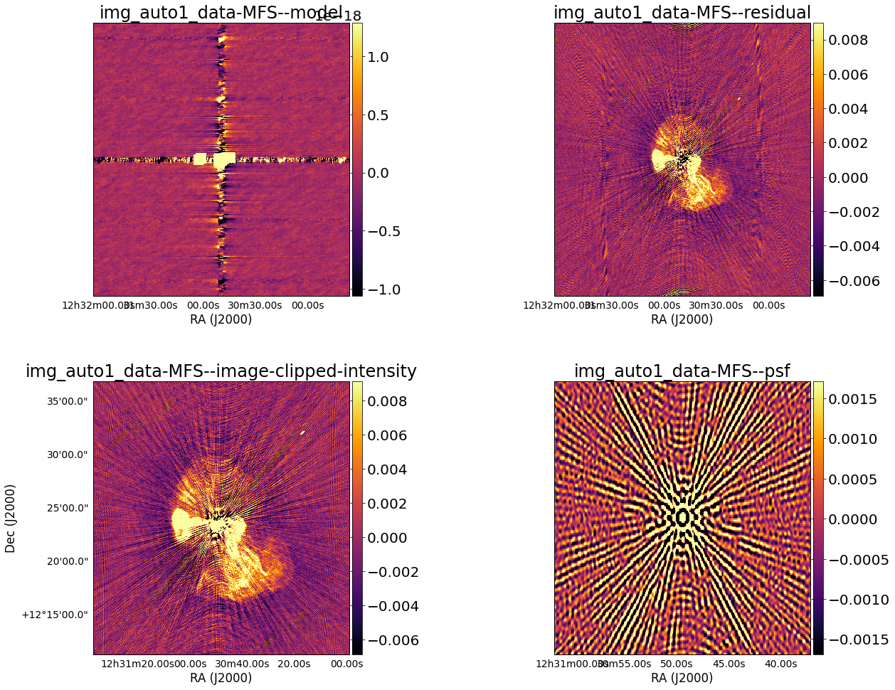

# Multi Image


---
 * `multi_image` is collection of python scripts that perform multiple Multi-Frequency Synthesis imaging jobs with various imaging and selfcal parameters. 
 * `multi_image` draws inspiration from [oxkat](https://github.com/IanHeywood/oxkat). 
 * Runs on the IDIA cluster

---
# Take Note
The pipeline makes use of the following software [CASA](https://casa.nrao.edu/docs/TaskRef/TaskRef.html), [Wsclean](https://sourceforge.net/p/wsclean/wiki/Home/), [Aimfast](https://aimfast.readthedocs.io/en/master/intro.html) and [pyBDSF](https://www.astron.nl/citt/pybdsf/). Since the pipeline works by submiting bash scripts to a slurm worker node (non-interactively) you will need to specify the path to the singularity images of the software used by the pipeline, that is, change the container path at the top of the main script (alpha_main.py). You will also need to change the ms_back directory. Here I'm making the assumption that you operate like I do, by keeping all the ms files in a back up directory in your scratch area

## Executing the pipeline
As per the do's and don'ts of the [ILIFU](http://docs.ilifu.ac.za/#/getting_started/submit_job_slurm?id=specifying-resources-when-running-jobs-on-slurm) cluster, clone the repo into your scratch area:

```
mkdir example_dir
cd example_dir
git clone https://github.com/LeonMtshweni/multi_image/
cd multi_image/
```
Edit the config file should the defaults not be suitable for you:
```
vi config.yaml
```

Then execute the python script:

```
python alpha_main.py
```
This will take a minute. Once terminal is freed up, inspect that the bash scripts are to your satisfaction:
```
more scripts/*
```
Once you're happy with the output, you may submit the jobs:

```
source submit_jobs.sh
```
Your jobs should now be submitted to slurm. The ilifu cluster resources are sought after and your job may not be run as soon as you submit, if many users are requesting resources from the system your job may be queued for the next available resources. You can check on your progress via passing your user name to the squeue command:
```
squeue -u <your_user_name>
```
It may take a while before your job actually runs, for a quick estimate enter:
```
squeue -u <your_user_name> --start
```
